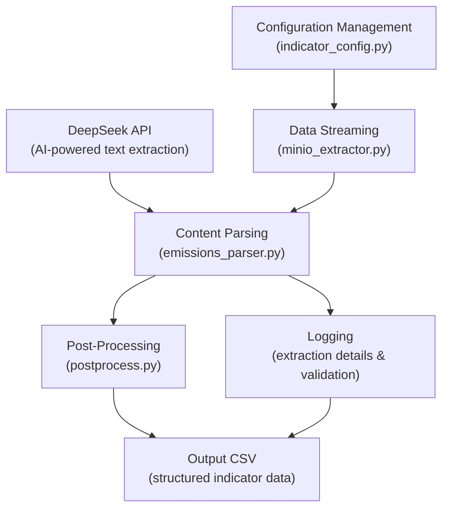

# coursework_two - CSR Data Extraction Project

This project automates the extraction and logging of CSR (Corporate Social Responsibility) indicators (e.g., carbon emissions, water consumption, renewable energy use, waste management, and materials usage) from PDF reports stored in a MinIO bucket. It uses Deepseek API for semantic extraction and is structured for scalability and maintainability.

## Project Strucure

```bash
.
├── Main.py                          # Entry point for the extraction
├── config/
│   └── indicators.yaml              # Indicator configuration with aliases and validation
├── docs/
│   ├── source/
│   │   ├── conf.py                   # Sphinx configuration
│   │   └── index.rst                 # Sphinx root page
│   └── _build/                       # Generated HTML documentation
├── logs/
│   └── final_output.csv              # Extracted indicator values
├── src/
│   ├── modules/
│   │   ├── db/
│   │   │    └── data_storage.py           # Store cleaned CSR data into PostgreSQL
│   │   ├── input/
│   │   │   ├── emissions_parser.py    # Core extraction logic
│   │   │   ├── indicator_config.py    # Loads YAML configs
│   │   │   └── minio_streaming_extractor.py # Streams PDFs from MinIO
│   │   └── output/
│   │       ├── data_clean.py         # Data cleaning and transformation
│   │       └── data_export.py        # Export and merge metadata for UI
│   └── UI/                           # Accessing the UI
├── tests/                             # Unit tests
├── pyproject.toml                     # Poetry configuration
├── poetry.lock                        # Poetry lock file

```

## Core Features

- **MinIO Integration**: Stream CSR reports directly from S3-compatible storage
- **DeepSeek API Extraction**: Semantic indicator value extraction based on names and aliases
- **YAML-Based Config**: Flexible indicator definitions including aliases and validation rules
- **CSV Logging**: Consolidated output for all extractions
- **Validation and Cleaning**: Postprocessing to validate numeric ranges and standardize units
- **PostgreSQL Integration**: Cleaned and transformed data automatically loaded into a (`csr_reporting`) schema via SQLAlchemy
- **Sphinx Documentation**: Auto-generated project documentation

## How to Run

Installation Guide

### 1. Clone the repository:

``` bash
git clone https://github.com/Boissek123/coursework_two.git
cd coursework_two
```

### 2. Install dependencies:
``` bash 
poetry install --with dev
```

3. Create a .env file in the project root:
``` bash
DEEPSEEK_API=your_deepseek_api_key_here
```

```bash
MINIO_ENDPOINT=minio:9000
MINIO_ACCESS_KEY=ift_bigdata
MINIO_SECRET_KEY=minio_password
MINIO_SECURE=false
```

```bash
DB_NAME=fift
DB_USER=postgres
DB_PASSWORD=postgres
DB_HOST=postgres
DB_PORT=5439
SCHEMA_NAME=csr_reporting
TABLE_NAME=company_indicators
```

## Usage Instructions

To run the full extraction pipeline:
``` bash 
poetry run python Main.py
```
This will:
1. Load your indicator definitions from (`config/indicators.yaml`)
2. Read optional run settings (e.g. frequency) from (`config/conf.yaml`)
3. Connect to the MinIO bucket (`csr-reports`) and stream all PDF files
4. Chunk each PDF and send those chunks to the DeepSeek API for indicator extraction
5. Aggregate and log the raw results into (`logs/final_output.csv`)
6. Clean that raw CSV ((`logs/final_output.csv`)) into a normalized file ((`logs/cleaned_output.csv`)) via (`data_clean.py`)
7. Store the cleaned data into Postgres under the (`csr_reporting.company_indicators`) table via (`data_storage.py`)
8. Export joined company metadata + indicators to a UI-friendly CSV ((`logs/export_ui.csv`)) via (`data_export.py`)

## Architecture Overview



## API Reference (Autogenerated)

All code modules follow Google-style docstrings and can be found under:

- (`src/modules/db/`)
- (`src/modules/input/`)
- (`src/modules/output/`)

These are documented automatically by Sphinx.

## How to Add or Modify Indicators

Edit the (`config/indicators.yaml`) to:
+ Add new sustainability metrics
+ Define units, targets, value types, aliases and validation constraints

example:
``` yaml
- theme: Renewable Energy
  indicators:
    - name: Renewable Energy Usage
      key: renewable_energy_use
      unit: MWh
      expected_type: float
      aim: increase
      has_target: true
      aliases:
        - Renewable Electricity Usage
        - Green Energy Usage
      validation:
        min: 0
        max: 10000000
        warn_above: 5000000
```

## Technologies Used

- Python 3.12+
- Deepseek API (deepseek-chat)
- requests for HTTP calls
- MinIO Python SDK (minio)
- pypdf for PDF parsing
- python-dotenv for environment variables
- PyYAML for configuration loading
- Sphinx for documentation
- Poetry for dependency and environment management

## Database & ETL Pipeline

This project includes a dedicated Postgres schema plus a three-stage ETL process to prepare, enrich and load all CSR metrics.

### PostgreSQL Schema

We keep all CSR data in the `csr_reporting` schema of the `fift` database:

- **company_static**  
  – Stores unchanging company metadata (symbol, name, sector, etc.).

- **company_reports**  
  – Tracks each CSR report’s metadata (URL, year, etc.).

- **company_indicators**  
  – Central table for all extracted sustainability metrics.  
    – Composite primary key `(company, year)` ensures one record per company per year.  
    – Columns use appropriate numeric types (floats for absolute values and percentages).

### ETL Pipeline Overview

1. **Extract & Clean**  
   – Load raw extraction output.  
   – Normalize numeric vs. reduction‐percentage values.  
   – Convert units (e.g. GWh→MWh).  
   – Validate against configured thresholds.  
   – Reorder and type‐cast fields for consistency.

2. **Enrich & Merge**  
   – Read `company_static` and `company_reports` from Postgres.  
   – Standardize identifiers (trim, uppercase).  
   – Join static company info with report metadata.  
   – Attach contextual fields (e.g. symbol, security) to each indicator record.

3. **Validate Schema & Load**  
   – Ensure `csr_reporting.company_indicators` exists (create schema/table if necessary).  
   – Append cleaned, enriched records into `company_indicators` via SQLAlchemy.  
   – Maintain referential integrity and support time‐series analysis.

This pipeline runs immediately after the PDF-to-data extraction step, delivering clean, enriched CSR metrics ready for downstream queries and analytics.  

## Documentation

We provide Sphinx-generated docs in both HTML and PDF formats.

### Building the docs

```bash
# 1. HTML output
poetry run sphinx-build -b html docs/source docs/_build/html

# 2. PDF output (requires a working LaTeX toolchain)
poetry run sphinx-build -b latex docs/source docs/_build/latex
cd docs/_build/latex
make all-pdf
```

### Viewing the docs
- HTML: Open (`docs/_build/html/index.html`) in your terminal.
- PDF: Open (`docs/_build/latex/courseworktwo.pdf`) in your terminal.

## UI Usage

To launch the web UI that lets you browse and interact with the extracted CSR data:

1. In a terminal, change into the UI directory:
```bash
   cd UI
```

2. Install its python dependencies:
```bash
pip install -r requirements.txt
```

3. Open your browser at:
``` bash
http://127.0.0.1:8000/
```

## FAQ

Q: What happens if an indicator is missing from the PDF?

A: It will be logged as (`N/A`) in the output CSV.

Q: Can I change the Deepseek model?

A: Yes, you can adjust the model name inside (`emissions_parser.py`) in the (`query_deepseek()`) function.

Q: How is alias matching handled?

A: The pipeline maps any detected alias to its canonical indicator name automatically during extraction.

Q: Can I extract the report year automatically?

A: Yes, the script extracts the report year from the first page separately.